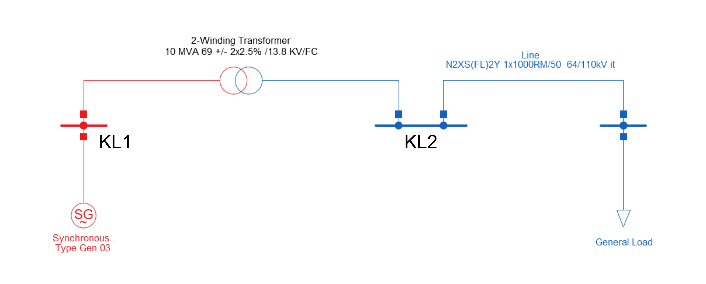

Concepts of the Generic Data Format
===================================

The Generic Data Format (GDF) format is the import and export target for the Generic Model Converter.
It is fully serializable to JSON and can represent the model blocks and their (named) connections.

Data Structure
--------------

The ``DataStructure`` class defines the energy system model in the GDF. It contains metadata, the components of the system and their relations to each other.
The core of this model representation is based on a `NetworkX <https://networkx.org/>`_ graph, which is serialized to JSON.

The **nodes** of this graph are component objects such as loads, buses or generators.
Subsystems are represented with the subsystem component that contain their own graph with internal components.

The **edges** represent the connections between the components.
The data field is used to map a string representation of the uid of a component to the name of the **connector** it is attached to.
This differentiation of connections is required for components that offer multiple connection points, such as transformers or transmission lines.

Connectors
^^^^^^^^^^

Looking at the following example, where a two-winding transformer is connected to two buses, "KL1" and "KL2".

In order to determine which bus is connected to which side of the transformer, the connector names need to be specified in the edge data.
The ``TwoWindingTransformer`` class defines two ``connector_names``: "HV" and "LV".
The edges connecting the transformer to the buses are defined as follows:

.. code-block:: python

   [
      (
         TwoWindingTransformer(uid=4, name='2-Winding Transformer', ...), 
         Bus(uid=0, name='KL1', ...), 
         {'4': ['LV']}  # the edge data with the connector name
      ), 
      (
         TwoWindingTransformer(uid=4, name='2-Winding Transformer', ...), 
         Bus(uid=1, name='KL2', ...), 
         {'4': ['HV']}  # the edge data with the connector name
      )
   ]

Each edge contains a dictionary that maps the ``uid`` of the relevant component to the connectors involved.
In this example, the buses don't distinguish between connections. Thus, only the connector names of the transformer are included in the dictionary.

This approach also allows multiple connections between two components with a single edge.
In this case, the connector names are matched based on their position in the lists:

.. code-block:: python

   {
      '0': ['Out', 'In'],
      '1': ['In', 'Out']
   }

In this example, the two components each define an input and output connector.
The edge data maps the output of component ``0`` to the input of component ``1`` and vice versa.

Components
----------

Most of the GDF components are based on their PowerFactory counterparts. The base component has the following fields:

* :code:`uid`: The unique identifier of the component (integer).
* :code:`name`: The name of the component.
* :code:`coords` (optional): The geographic coordinates of the component in the model. This can be a tuple of floats to represent a point or a list of float tuples to represent a route.
* :code:`connector_names`: The expected names for the connectors of the component. Not set for all components.

The ``DataStructure`` class expects the uid to be positive and unique in the entire model -- including subsystems.
The uid of a component is used to identify the component in the data field of the edges.

The use of NetworkX for the main data structure requires that components must be hashable.
Since the components are implemented as dataclasses, they need to have ``unsafe_hash=True`` or a custom hash function to be defined.
As noted in `Python dataclass <https://docs.python.org/3/library/dataclasses.html>`_, this requires the class to be functionally immutable.
As of now, this immutability is not enforced. However, Components are usually created, removed or replaced -- not mutated.

Default Values
^^^^^^^^^^^^^^

Dealing with many different data formats and modeling approaches, means that the same conceptual model,
such as a transmission line, can be defined by vastly different underlying mathematical models with different parameter sets.
This circumstance requires the generic component models to be flexible enough to incorporate the relevant details for as many platforms as possible
but also not require all details, since some platforms might not provide the information required by others.

To solve this issue, component classes can define their attributes as optional by allowing ``None`` values.
When importing data from a platform that does not provide a value for such an attribute, it stays as ``None``.
During the export process, these empty attributes can be filled with default values.

The base ``Component`` class defines the ``get_fb`` method for this case.
It returns the actual value if it is set and retrieves a default value as a fallback.
In other cases, missing values might be calculated based on existing values in other attributes.

Let's illustrate this with the ``TLine`` class that models a transmission line.
This class contains an ``angle_min`` attribute that is only used by JMDL and is thus ``None`` when importing data from any other platform.

In the JMDL export, we use 

.. code-block:: python

   tline.get_fb("angle_min")

instead of accessing the attribute directly in order to ensure that it is filled with a sensible default in case the attribute is ``None``.
Furthermore, JMDL requires different ratings for long-term and short-term line loading.
Unfortunately, many other platforms only provide a single value for transmission line ratings.
In this case, it doesn't make much sense to provide a fixed default value, since the short-term rating might depend on a given long-term rating.
Thus, the ``TLine`` class defines custom fallback methods for these rating values, e.g. ``rating_short_term_fb()``.
This method takes the mandatory ``rating`` value and multiplies it with a defined factor to obtain a fallback for the short-term rating.

Default values and values used for fallback calculation can be customized using configuration files (see :doc:`configuration`).
These can be either defined globally or per target platform to enable setting defaults that match the requirements of the various platforms.

.. note:: 
   The usage of default values should always be logged in order to make the conversion process as transparent as possible.
   ``Component.get_fb`` and ``Component.get_default`` log automatically by default.
   However, logging might need to be implemented manually when creating custom fallback methods.

Subsystems
----------

``Subsystem`` components are created from an existing data structure with the :code:`Subsystem.from_components` method.
This method takes a list of components and creates a new ``Subsystem`` component with the listed components as their own graph within this subsytem.
The edges are then added to the graph of the subsystem component.

Connections between the components inside the subsystem and outside the subsystem are represented by a :code:`Port` component.
A ``Port`` component represents exactly one *real* component by settings the :code:`connection_component` field to the uid of the component it represents.
The figures below illustrate this mechanism:

.. image:: img/subsystemsNports.png
  :alt: A minimal example for the subsystem and port implementation.

**Figure A** shows the base case without any subsystems. The components are identified via their uid and the yellow boxes show the edge data for the corresponding connections.

**Figure B** shows the result of creating a new subsystem with the LV Bus component:
In addition to the ``Subsystem`` component, a ``Port`` component is created in this subsystem referencing the transformer (``connection_component=2``) outside the subsystem.
The edge data remains largely unchanged, only replacing the original uids with the uids of the newly created components.

**Figure C** shows the result of creating a new subsystem containing both buses:
The transformer is still represented by only one ``Port`` and inside the subsystem, the edges stay largely the same.
However, since only one edge between two components is allowed, **the two edges between the transformer and the buses are merged into one edge** between the transformer and the subsystem.
This is achieved by concatenating the connector names defined in the original edges.

**Figure D** shows the result of creating a new subsystem with the transformer:
Each bus is represented by a separate ``Port`` component. Otherwise, this is analogous to the case in Figure B.

.. toctree::
   :maxdepth: 1
   :glob:

   concepts/group_subsystem_rules

.. include:: concepts/logger.rst

ConverterBase
-------------

To make the converters to and from the generic format easier to implement, the :code:`ConverterBase` class provides some helper methods.
The ConverterBase class is an abstract class that provides a structure for the import and export process. The generic TypeVar :code:`Model` is used to represent the model data structure that is used by format the converter is converting from/to.
This can be a reference like a name or the entire model, depending on the format and provided API.

Import
^^^^^^
* :code:`to_gdf(model: Model) -> DataStructure`: Entire process of converting the model to the generic data format. Has a default implementation of calling the :code:`_pre_import`, :code:`_import` and :code:`_post_import` methods.
* :code:`_pre_import(model: Model) -> Model`: Pre-processing of the model like replacing references with the actual objects. This is called before the import process is started and can be used to modify the model before it is converted.
* :code:`_import(model: Model) -> DataStructure`: Import process of the model. This is called after the pre-processing and should convert the model to the generic data format. Optimally, this is just a mapping from the model components to the generic data format components.
* :code:`_post_import(model: Model) -> Model`: Post processing of the model after the import process. This is called after the import process is finished and can be used to add additional components to the model or to modify the existing components.

Export
^^^^^^
* :code:`from_gdf(gdf: DataStructure) -> Model`: Entire process of converting the generic data format to the model. Has a default implementation of calling the :code:`_pre_export`, :code:`_export` and :code:`_post_export` methods.
* :code:`_pre_export(gdf: DataStructure) -> DataStructure`: Pre-processing of the generic data format like replacing references with the actual objects. This is called before the export process is started and can be used to modify the generic data format before it is converted.
* :code:`_export(gdf: DataStructure) -> Model`: Export process of the generic data format. This is called after the pre-processing and should convert the generic data format to the model. Optimally, this is just a mapping from the generic data format components to the model components.
* :code:`_post_export(gdf: DataStructure) -> DataStructure`: Post processing of the generic data format after the export process. This is called after the export process is finished and can be used to add additional components to the generic data format or to modify the existing components.
